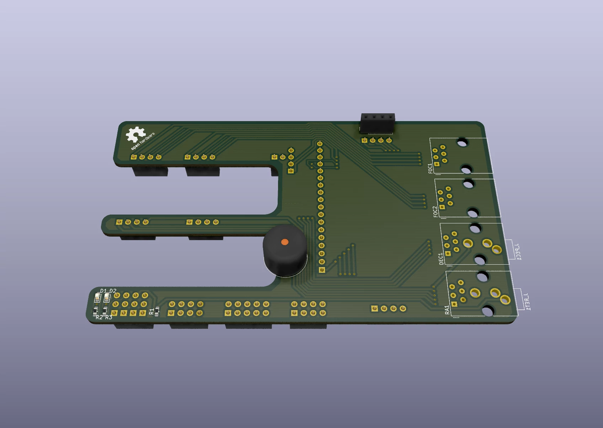

# onstep-ramps-shield

This is an add-on board for a RAMPSv1.4 (and some later versions) board, which
carries a bit of additional hardware necessary for an
[OnStep](https://github.com/hjd1964/OnStep)
telescope controller.

There are different ways to build an OnStep, including using a completely custom
board, but I liked the modular approach and used an Arduino Mega in combination
with a RAMPS shield. The custom boards of course offer places to fit connectors
and such which the Arduino/RAMPS combination doesn't, so I'm trying to build
this board to help with that.

## Status

**WIP**, I've not tested or built the board yet and will update this document once
there's more to say about it.

At the moment, the board takes the following components:
- RA motor connector, RJ12 6p6c
- DEC motor connector, RJ12 6p6c
- Focuser motor 1 connector, RJ12 6p6c
- Focuser motor 2 connector, RJ12 6p6c
- Polar alignment scope illuminator connector, 3-Pin 3.5mm audio jack
- PEC sensor connector, 3-Pin 3.5mm audio jack
- Buzzer
- DS3231 RTC via I2C
- BME280 environmental sensor via I2C
- HC05 Bluetooth module via Serial

